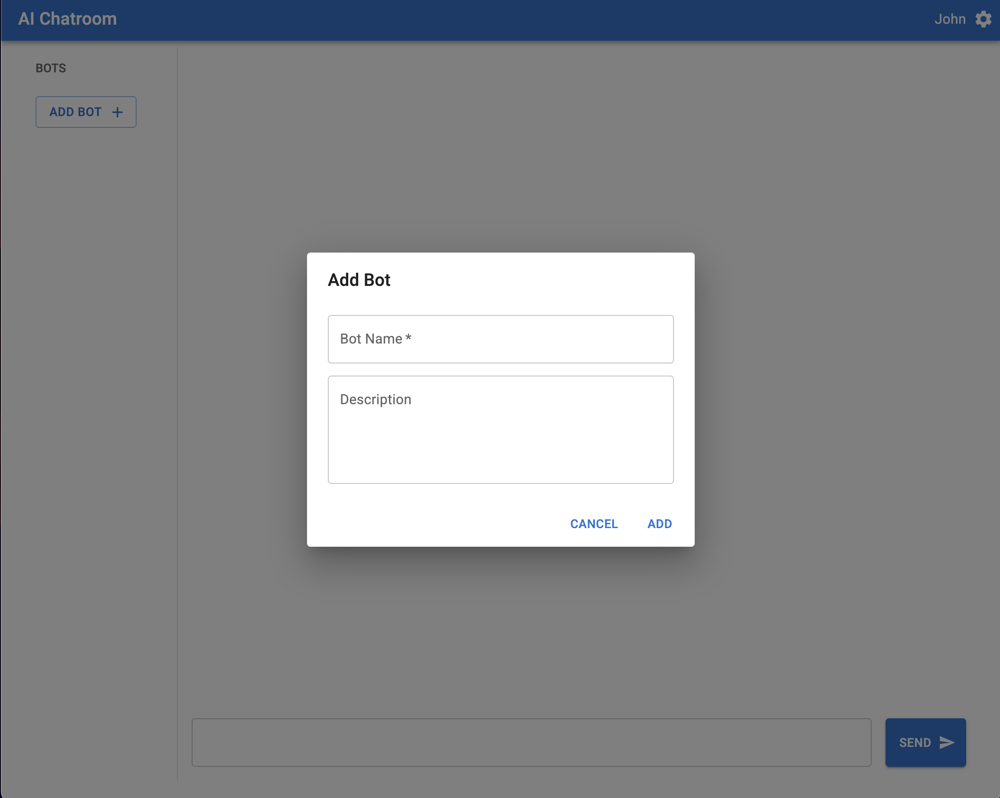

# ai-chatroom

## Features


[Demo](screenshots/demo.mov)


An interactive multi-bot AI chatroom powered by the CHAI backend. Users can add multiple AI bots to the room and watch them converse in real time. Built with FastAPI (Python) for the backend and React + MUI for the frontend.

- Multi-Bot Conversations
- Add/Remove Bots
- Custom Bot Personas
- Real-Time "Thinking" Indicator
- Download Chat History
- Stop Bot Responses
- Clear Chat History

### [Screenshots](screenshots/):
<details>
<summary>
Main view, with chat history, bot list, "Thinking" indicators next to bot names
</summary>


</details>

<details>
<summary>
Options: "Clear Chat", "Stop Bots" and "Download Chat History"
</summary>


</details>

<details>
<summary>
Add a bot
</summary>


</details>

<details>
<summary>
User name input
</summary>


</details>

## Run the project locally

Make sure Python and node are installed.

Start the backend:

```sh
cd backend
python -m venv venv
source venv/bin/activate
# Generate environment variables with the API token
echo -e 'API_URL="http://guanaco-submitter.guanaco-backend.k2.chaiverse.com/endpoints/onsite/chat"\nAPI_KEY="CR_14d43f2bf78b4b0590c2a8b87f354746"' > ../.env
pip install -r requirements.txt
uvicorn app.main:app --host 0.0.0.0 --port 8000 --reload
cd ..
```

Start the frontend:

```sh
cd frontend
npm install -g yarn
yarn --frozen-lockfile
yarn start
```

## Project overview

### Backend

The Python backend implements the following [routes](backend/app/routes):

- `/ws`: Web Socket. Backend use it to send bot respones, and bot active status. Frontend uses it to send user messages.
- `GET /chat_history`: Get the chat history.
- `DELETE /chat_history`: Delete the chat history.
- `GET /download`: Download the chat history.
- `GET /bots`: Get bot list.
- `POST /bots`: Add new bot.
- `DELETE /bots`: Delete user specified bot, or all bots if no bot name is provided.
- `POST /interrupt_bots`: Stop bot conversation.
- `GET /user_name`: Get user's name.
- `POST /user_name`: Update user's name.

The main chat room logic lives in [session.py](backend/app/services/session.py), which implements a singleton Session object.

The session object is responsible for maintaining the bots, the chat history, the user name, the Web Socket connection with the frontend, and the connection to the AI backend.

In the current implementation, all conversations have to be initiated by the user. If there are multiple bots in the session, one bot will be picked randomly from the bot list to be the next respondent. As a future improvement, we could calculate bots' interest in the conversation using heuristics or calling LLM so bots can start and stop talking more natually.

### Frontend

Frontend implemented in React and [MUI](https://mui.com/material-ui/).

All the server interactions are implemented as [contexts](frontend/src/contexts). It is a thin network layer. All server errors will display as alerts in a [MUI snackbar](https://mui.com/material-ui/react-snackbar/).

The UI is divided into the following views:
- [MainView](frontend/src/components/MainView.tsx): The grid UI which contains everything.
- [BotsView](frontend/src/components/BotsView.tsx): The bot list side bar.
- [ChatHistoryView](frontend/src/components/ChatHistoryView.tsx): The chat history on the right side above the text input.
- [ChatInputView](frontend/src/components/ChatInputView.tsx): The message input area and the "Send" button.
- [TopBarView](frontend/src/components/TopBarView.tsx): The top bar, including the gear button and the options menu (Clear chat, download chat, stop bots).
- [UserNameDialog](frontend/src/components/UserNameDialog): The dialog that pops up asking for user's name whenever a new chat is started.
